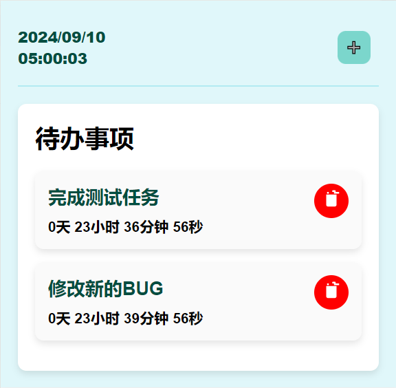
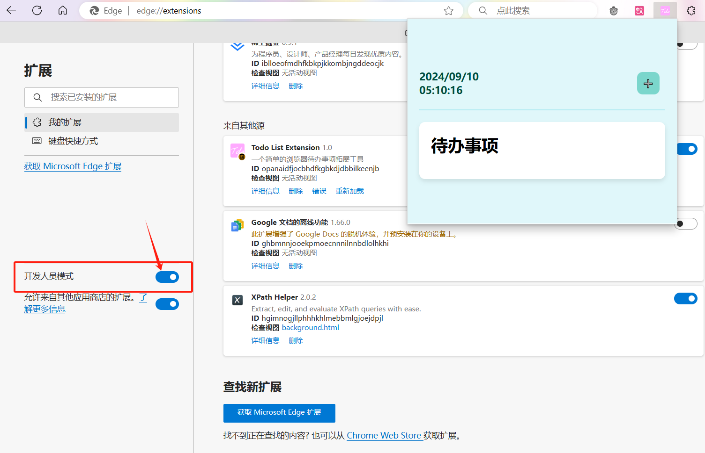
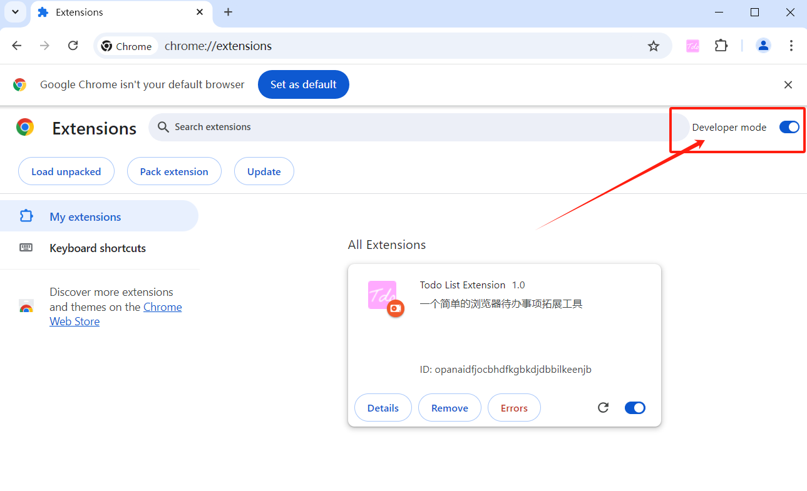
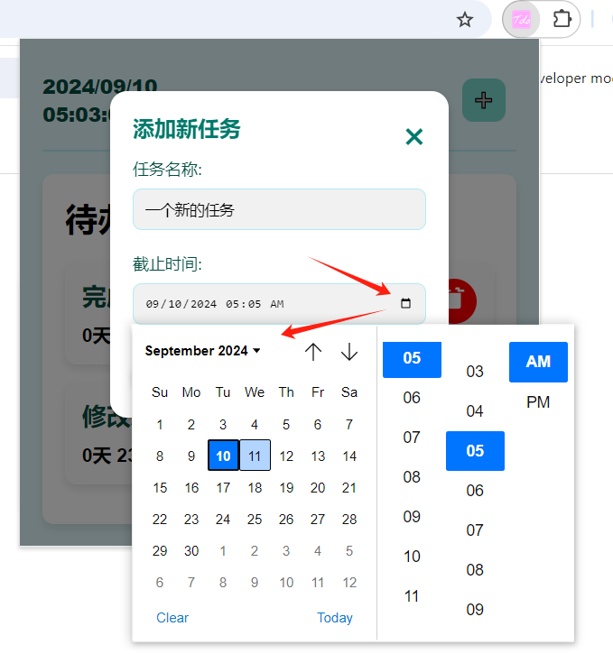

# Tdo - 浏览器记事本拓展


一个超级简单的浏览器拓展——记事本，采用最原生的写法构建该拓展，IndexedDB存储数据。



```
Tdo/
│
├── css/
│ └── style.css
│
├── js/
│ └── app.js
│
├── images/
│ ├── favicon.ico
│ └── favicon-32x32.png
│
├── index.html
└── manifest.json
```


### 安装

该拓展当前适配Edge和Chorm浏览器，需要打开[edge://extensions](edge://extensions)或[chrome://extensions](chrome://extensions/)启动开发者模式，并将已打包好的[Tdo.zip](https://github.com/QiPanTanYi/Tdo/releases/tag/v1)中的Tdo这个文件夹整个拖入到当前页面中，即可完成安装。(点击[链接](https://github.com/QiPanTanYi/Tdo/releases/tag/v1)下载Tdo.zip到本地，可以放置在自己喜欢的任何文件路径中)





### 效果展示



- [x] 当前日期
- [x] 事务倒计时
- [x] 存储：IndexedDB
- [x] 添加事务
- [x] 删除事务
- [x] 提示弹窗和提示音